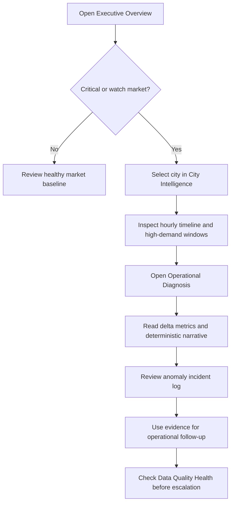

# UX Submission
## Ride-Sharing Operational Intelligence Platform

**Project type:** Operational analytics dashboard
**Primary users:** City operations leaders, marketplace analysts, and data-quality owners
**Primary device:** Desktop workstation
**Secondary device:** Laptop and tablet-width browser
**UX status:** Implemented reference experience

---

## 1. UX Summary

The platform is designed as a focused operational intelligence console. Its job is to help a user move from a broad market-risk scan to a defensible city-level diagnosis in a few steps.

The experience is intentionally dense and work-oriented rather than promotional. It prioritizes:

- Fast comparison across cities.
- Clear separation between normal and high-demand behavior.
- Strong visual hierarchy for risk, deltas, and anomalies.
- Evidence before recommendation.
- Consistent metrics across every page.
- Visible data-quality and performance context.

### Core UX promise

> A user should be able to identify the highest-risk market, understand what changed during peak demand, and inspect the evidence without opening raw event files.

---

## 2. User Problem

Operations teams receive large amounts of ride-event data but need answers in operational language:

1. Which city is under the most strain?
2. Is the strain temporary or recurring?
3. Did driver acceptance, rider cancellation, wait time, or surge change most sharply?
4. Which hours should the team investigate?
5. Can the conclusion be trusted?

The UX turns these questions into a guided investigation rather than presenting an unstructured data dump.

---

## 3. Personas

### City Operations Leader

**Goal:** Prioritize the market that needs intervention.

**Pain point:** Raw volume and isolated incidents do not show whether the problem is structural.

**Important information:** Risk status, cancellation delta, acceptance delta, consistency, and recommended action.

### Marketplace Analyst

**Goal:** Investigate hourly and peak-period behavior.

**Pain point:** Normal and high-demand periods are often mixed together in conventional reports.

**Important information:** Hourly trends, high-demand markers, correlations, surge, and anomaly records.

### Data Quality Owner

**Goal:** Confirm that the dashboard is safe to use for operational decisions.

**Pain point:** A polished chart can still be based on incomplete or inconsistent data.

**Important information:** Quality score, row counts, null distributions, state consistency, and query latency.

---

## 4. Information Architecture

```text
Mobility Operations Console
|
+-- Executive Overview
|   +-- Global KPI strip
|   +-- City risk matrix
|   +-- Operational alerts
|   +-- City summary table
|
+-- City Intelligence
|   +-- City selector
|   +-- Peak-vs-baseline KPI strip
|   +-- Hourly operational timeline
|   +-- Hourly profile and regime breakdown
|
+-- High Demand Analysis
|   +-- P85 methodology explanation
|   +-- Pearson correlation matrix
|   +-- Spearman correlation matrix
|   +-- Cross-metro relationship view
|
+-- Operational Diagnosis
|   +-- City selector
|   +-- Risk classification and delta KPIs
|   +-- Deterministic diagnosis briefing
|   +-- Statistical anomaly incident log
|
+-- Data Quality Health
    +-- Pipeline health and record count
    +-- Query latency benchmarks
    +-- Quality gate score
    +-- Null distribution table
```

The information architecture follows a progressive-disclosure pattern:

1. **Scan:** Executive Overview gives the broad posture.
2. **Compare:** City Intelligence shows one market over time.
3. **Explain:** High Demand Analysis and Operational Diagnosis show relationships and drivers.
4. **Trust:** Data Quality Health verifies the evidence base.

---

## 5. Primary User Flow

### Market-risk investigation



### Key interaction path

- **Entry point:** Executive Overview.
- **Primary action:** Select or investigate a city.
- **Decision point:** Determine whether deterioration is recurring.
- **Evidence view:** Hourly trends and anomaly log.
- **Decision support:** Deterministic diagnosis and recommended operational focus.
- **Trust check:** Data Quality Health.

---

## 6. Page UX Specifications

### 6.1 Executive Overview

**User question:** Where should I focus first?

**Layout and hierarchy:**

1. Global KPI strip at the top for immediate orientation.
2. Large city risk matrix for comparison.
3. Operational alert cards for prioritized markets.
4. Expandable summary table for detailed comparison.

**Interaction design:**

- Risk matrix uses driver acceptance on the X-axis and rider cancellation on the Y-axis.
- Bubble size communicates high-demand volume.
- Color communicates operational status: critical, watch, or healthy.
- Hover details expose surge, consistency, and metric deltas.
- The summary table supports exact comparison when the chart is insufficient.

**UX rationale:** The page answers the executive "where" question before asking the user to inspect details.

### 6.2 City Intelligence

**User question:** When does this city break down?

**Layout and hierarchy:**

1. City selector in the header area.
2. Selected-city KPI strip comparing normal and peak regimes.
3. Hourly timeline with acceptance, cancellation, and surge.
4. High-demand windows visually marked on the timeline.
5. Hourly profile and regime breakdown below the timeline.

**Interaction design:**

- The city selector changes all page metrics together.
- A shared time axis supports comparison of operational signals.
- High-demand windows are shaded so the user can connect demand regime to behavior.
- Dual axes separate percentage rates from surge multiplier without forcing separate charts.

**UX rationale:** The page makes temporal concentration and peak deterioration visible in one continuous investigation surface.

### 6.3 High Demand Analysis

**User question:** What patterns are associated with high-demand friction?

**Layout and hierarchy:**

1. Methodology briefing explains the city-specific P85 rule.
2. Pearson and Spearman matrices provide complementary statistical views.
3. A plain-language statistical finding translates the matrix into an operational signal.
4. Cross-metro scatter analysis allows broader comparison.

**Interaction design:**

- The methodology is shown before the result so users understand how peak periods were defined.
- Pearson communicates linear association; Spearman communicates monotonic association.
- The metro filter changes the relationship view without changing the methodology.

**UX rationale:** The page prevents users from treating an unexplained threshold or a single correlation number as a complete conclusion.

### 6.4 Operational Diagnosis

**User question:** Why is this city classified as risky?

**Layout and hierarchy:**

1. City selector.
2. Risk, acceptance, cancellation, and surge KPI strip.
3. Deterministic diagnosis briefing.
4. Recommended operational focus.
5. Hourly anomaly incident log.

**Interaction design:**

- The selected city controls the diagnosis context.
- Delta values are shown with baseline and high-demand values together.
- The narrative is generated from the same metrics displayed above it.
- The anomaly table provides inspectable hourly evidence.
- Empty anomaly results use an informational empty state instead of an error.

**UX rationale:** The page connects measured change to a next investigative action without hiding the underlying evidence.

### 6.5 Data Quality Health

**User question:** Can I trust this analysis?

**Layout and hierarchy:**

1. Pipeline health, record count, storage engine, and environment cards.
2. Query latency benchmark table.
3. Quality gate score and state-integrity counts.
4. Column null-distribution table.

**Interaction design:**

- Health information is visible in the same product rather than hidden in logs.
- Latency results are shown beside their pass/warning budget status.
- Null and integrity checks are presented as inspectable tables.

**UX rationale:** Trust is treated as part of the product experience, not as a separate engineering concern.

---

## 7. Visual Design System

### Design direction

The interface uses a restrained editorial operations aesthetic inspired by analytical publications and work tools. It avoids a promotional hero layout and keeps the primary experience focused on repeated investigation.

### Color semantics

| Token | Role | Meaning |
| --- | --- | --- |
| Warm off-white | Application canvas | Calm reading surface |
| Warm panel beige | Cards and controls | Grouped information |
| Olive green | Healthy and positive state | Resilience or acceptable performance |
| Terracotta | Critical deterioration | Immediate operational concern |
| Amber | Watch state | Needs attention but not yet critical |
| Blue | Neutral delta and supporting information | Context without risk emphasis |
| Dark brown-black | Primary text | High-contrast reading |

Status labels always include text in addition to color, so the meaning is not color-dependent.

### Typography

- **Inter:** Primary interface text for clear scanning.
- **JetBrains Mono:** Query, status, and technical values where fixed-width reading helps.
- Uppercase small labels establish hierarchy for KPI context.
- Large values use tabular numerals for comparison.
- Headings are compact and sized for a dense operational tool rather than a marketing hero.

### Components

- KPI strip for high-signal summary values.
- Alert card for prioritized market deterioration.
- Briefing card for diagnosis and recommended action.
- Selectbox for city filtering.
- Plotly chart for relationship and time-series exploration.
- Dataframe for exact values and audit details.
- Status pill for critical, watch, and healthy classifications.

### Layout principles

- Wide desktop canvas with a constrained content width.
- Sidebar for global controls and rebuild action.
- Two-column layouts for comparison where appropriate.
- Full-width charts for time-series reading.
- Small border radius and restrained borders to keep the interface work-focused.
- Spacing and divider lines separate analytical stages without creating decorative card nesting.

---

## 8. Usability Principles

1. **Scan before drilling down.** Global posture appears before detailed evidence.
2. **Compare like with like.** Normal and high-demand values appear together.
3. **Show the denominator.** Consistency includes degraded and total windows.
4. **Explain labels with evidence.** Risk status is paired with deltas and metrics.
5. **Keep the user oriented.** Page title, subtitle, selector, and section headings establish context.
6. **Prefer inspectable outputs.** Tables remain available beside charts.
7. **Fail visibly and gracefully.** Empty states and quality status prevent silent ambiguity.
8. **Avoid unsupported certainty.** Correlations and deterministic diagnoses are presented as evidence, not proof of causality.

---

## 9. Accessibility and Inclusive Design

### Current support

- Text labels accompany status colors.
- Charts include titles, axis labels, legends, and hover detail.
- Tables provide an exact alternative to visual chart interpretation.
- Controls use native Streamlit selectboxes and buttons.
- Text and background colors are selected for strong contrast in the warm palette.
- Layouts use responsive columns and auto-fit alert content where possible.

### Review checklist for submission

- [ ] Keyboard navigation works through sidebar, selectors, buttons, expanders, and tables.
- [ ] Focus states remain visible after custom CSS is applied.
- [ ] Plotly charts have meaningful titles and non-color cues.
- [ ] Status meaning remains clear in grayscale or color-deficient viewing.
- [ ] Text remains readable at 200% browser zoom.
- [ ] Tables remain usable on narrower laptop widths.
- [ ] Custom HTML is checked with an accessibility tree or browser audit.
- [ ] Error and empty states explain what happened and what action is available.

---

## 10. Responsive Behavior

The primary experience is desktop-first because operations teams compare several metrics and tables at once. The interface uses Streamlit columns and responsive grid behavior to degrade gracefully:

- KPI cards move into narrower columns as the viewport shrinks.
- Alert card metric grids use auto-fit columns.
- Charts retain bounded heights rather than expanding unpredictably.
- Tables remain available as the most precise fallback for chart interpretation.
- The sidebar remains the navigation and control surface.

A final submission review should include at least one desktop screenshot and one laptop-width screenshot to demonstrate readable labels and non-overlapping controls.

---

## 11. UX Evidence for Submission

Recommended evidence package:

1. **Executive Overview screenshot** showing the KPI strip, risk matrix, and alert section.
2. **City Intelligence screenshot** showing the city selector, timeline, and high-demand shading.
3. **Operational Diagnosis screenshot** showing the diagnosis briefing and anomaly table.
4. **Data Quality Health screenshot** showing pipeline health and quality score.
5. **Short screen recording** of the flow: select a city, inspect the timeline, open diagnosis, and review anomalies.
6. **PRD link** showing the product goals and acceptance criteria.
7. **Test result** showing the automated suite passing.

### Suggested 60-second walkthrough

- 0-10 seconds: Open Executive Overview and identify the highest-risk city.
- 10-25 seconds: Open City Intelligence and select that city.
- 25-40 seconds: Point out high-demand windows and the acceptance/cancellation movement.
- 40-52 seconds: Open Operational Diagnosis and show the deterministic narrative.
- 52-60 seconds: Show the anomaly log and Data Quality Health page.

### UX success statement

The UX succeeds when a reviewer can answer all five product questions - where, what, when, why, and how consistently - without leaving the dashboard or inspecting raw files.

---

## 12. Known UX Risks and Next Improvements

| Risk | Current mitigation | Next improvement |
| --- | --- | --- |
| Dense dashboard can overwhelm new users | Progressive page structure and captions | Add a first-run guided walkthrough |
| Custom HTML may reduce semantic accessibility | Native controls and visible text labels | Run browser accessibility audit and improve landmarks |
| Long anomaly tables can require scanning | Ordered query results and visible columns | Add severity and city filters |
| Desktop-first layouts may compress on small screens | Responsive columns and auto-fit cards | Add a dedicated compact layout review |
| Correlation may be read as causation | Methodology and evidence language | Add explicit "association is not causation" helper text |
| Static 300-second cache can hide a rebuild immediately | Rebuild action clears data cache | Add last-refresh timestamp and run identifier |

---

## 13. Traceability

| UX element | Implementation |
| --- | --- |
| Global shell and rebuild control | `dashboard/app.py` |
| Visual tokens and responsive CSS | `dashboard/utils/styling.py` |
| KPI strips | `dashboard/components/kpi_card.py` |
| Operational alert cards | `dashboard/components/alerts_banner.py` |
| Cached data service | `dashboard/utils/db.py` |
| Executive experience | `dashboard/pages/1_Executive_Overview.py` |
| City investigation | `dashboard/pages/2_City_Intelligence.py` |
| Methodology and correlation experience | `dashboard/pages/3_High_Demand_Analysis.py` |
| Diagnosis and anomaly experience | `dashboard/pages/4_Operational_Diagnosis.py` |
| Trust and health experience | `dashboard/pages/5_Data_Quality_Health.py` |
| Product goals and acceptance criteria | `docs/product_requirements.md` |
